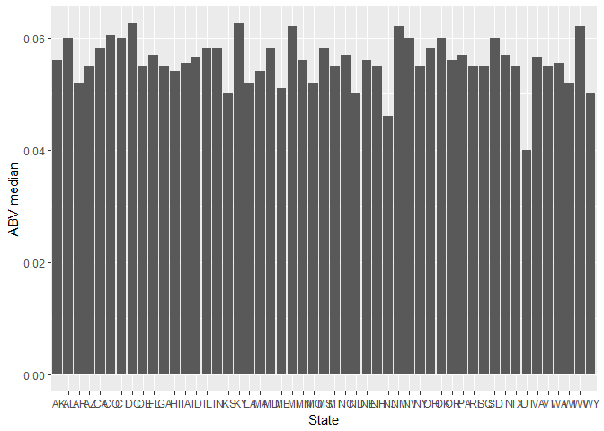
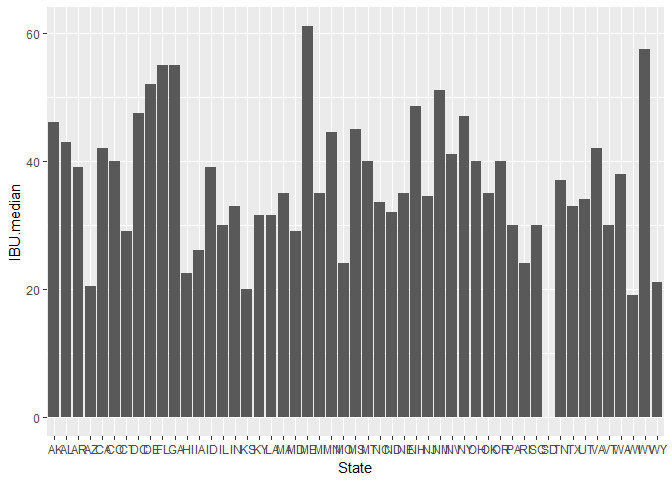
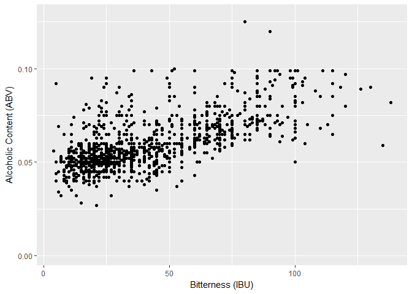

# Assignment
Bryan Cikatz  
June 27, 2017  

#Introduction

The purpose of this research is to get a greater understanding of beer production across the United States. Specifically, we have three critical questions to explore: 1) How does production capacity vary across states? 2) Do states have regional preferences (looking specifically at the median ABV and IBU in each state)? 3) Is there a relationship between the bitterness of beer and its alcoholic content? 

This research is based off of two data sets provided by management. The "Breweries" data set contains 558 observations and four variables. The variables are "Brew_ID" (a unique identifier for the brewery), "Name" (the name of the brewery), "City" (the city where the brewery is located), and "State" (the state where the brewery is located). The "Beers" data set contains 2410 observations and seven variables. The variables are "Name" (the name of the beer), "Beer_ID" (a unique identifier of the beer), "ABV" (alcohol by volume of the beer), "IBU" (International Bitterness Units of the beer), "Brewery_ID" (brewery id associated with the beer), "Style" (style of the beer), and "Ounces" (ounces of beer). It is also important to note that the ABV and IBU variables have missing entries. 

In the interests of being thorough, I have expanded  upon the core three questions so that there are seven total questions that I have answered. Hopefully, the following section provides an adequate account of my work in the event that this research needs to be reproduced. 


#Questions

Note: I exported the Excel files into a csv format as I personally find it easier to import a csv file as opposed to an xlsx file. However, both the original xlsx files and the new csv files are stored in the Data folder. 

IMPORTANT: Your specific file path is dependent upon how you organize the files in your computer. You will be forced to change the address preceding "/CaseStudy1" to reflect your personal system. 

```r
Breweries <- read.csv("C:/Users/Bryan/Documents/CaseStudy1/Data/Breweries.csv", header=TRUE, sep=",")
Beers <- read.csv("C:/Users/Bryan/Documents/CaseStudy1/Data/Beers.csv", header=TRUE, sep=",")
```

#1. How many breweries are present in each state?

The "State" variable in the "Breweries" data set is a factor-variable so the summary function will report the frequency of breweries in each state. 

```r
summary(Breweries$State)
```

```
##  AK  AL  AR  AZ  CA  CO  CT  DC  DE  FL  GA  HI  IA  ID  IL  IN  KS  KY 
##   7   3   2  11  39  47   8   1   2  15   7   4   5   5  18  22   3   4 
##  LA  MA  MD  ME  MI  MN  MO  MS  MT  NC  ND  NE  NH  NJ  NM  NV  NY  OH 
##   5  23   7   9  32  12   9   2   9  19   1   5   3   3   4   2  16  15 
##  OK  OR  PA  RI  SC  SD  TN  TX  UT  VA  VT  WA  WI  WV  WY 
##   6  29  25   5   4   1   3  28   4  16  10  23  20   1   4
```
The breweries in each state range from 1 brewery in the District of Columbia, North Dakota, South Dakota, and West Virginia (each state has 1) to 47 breweries in Colorado.

#2.  Merge beer data with breweries data by brewery id. Print first 6 observations and the last six observations to check the merged file.

The plyr package has the rename function that will be used to alter variable names. In the "Breweries" data set we need to rename "Brew_ID" to "Brewery_id" so it matches with the variable in the "Beers" data set. While optional, I also renamed the "Name" variable in each data set to something more distinct ("Name_Brewery" instead of "Name.x" and "Name_Beer" instead of "Name.y"). Using the merge function, we merge the data based on the shared variable "Brewery_id" (also making sure to bring along all variables). Finally, we use the head and tail functions to print the first and last observations.

```r
library(plyr)
Breweries <- rename(Breweries, replace = c("Brew_ID"="Brewery_id", "Name"="Name_Brewery"))
Beers <- rename(Beers, replace = c("Name"="Name_Beer"))
Merged_Data <- merge(x= Breweries, y= Beers, by= 'Brewery_id', all=TRUE)
head(Merged_Data, 6)
```

```
##   Brewery_id       Name_Brewery        City State     Name_Beer Beer_ID
## 1          1 NorthGate Brewing  Minneapolis    MN       Pumpion    2689
## 2          1 NorthGate Brewing  Minneapolis    MN    Stronghold    2688
## 3          1 NorthGate Brewing  Minneapolis    MN   Parapet ESB    2687
## 4          1 NorthGate Brewing  Minneapolis    MN  Get Together    2692
## 5          1 NorthGate Brewing  Minneapolis    MN Maggie's Leap    2691
## 6          1 NorthGate Brewing  Minneapolis    MN    Wall's End    2690
##     ABV IBU                               Style Ounces
## 1 0.060  38                         Pumpkin Ale     16
## 2 0.060  25                     American Porter     16
## 3 0.056  47 Extra Special / Strong Bitter (ESB)     16
## 4 0.045  50                        American IPA     16
## 5 0.049  26                  Milk / Sweet Stout     16
## 6 0.048  19                   English Brown Ale     16
```

```r
tail(Merged_Data, 6)
```

```
##      Brewery_id                  Name_Brewery          City State
## 2405        556         Ukiah Brewing Company         Ukiah    CA
## 2406        557       Butternuts Beer and Ale Garrattsville    NY
## 2407        557       Butternuts Beer and Ale Garrattsville    NY
## 2408        557       Butternuts Beer and Ale Garrattsville    NY
## 2409        557       Butternuts Beer and Ale Garrattsville    NY
## 2410        558 Sleeping Lady Brewing Company     Anchorage    AK
##                      Name_Beer Beer_ID   ABV IBU                   Style
## 2405             Pilsner Ukiah      98 0.055  NA         German Pilsener
## 2406         Porkslap Pale Ale      49 0.043  NA American Pale Ale (APA)
## 2407           Snapperhead IPA      51 0.068  NA            American IPA
## 2408         Moo Thunder Stout      50 0.049  NA      Milk / Sweet Stout
## 2409  Heinnieweisse Weissebier      52 0.049  NA              Hefeweizen
## 2410 Urban Wilderness Pale Ale      30 0.049  NA        English Pale Ale
##      Ounces
## 2405     12
## 2406     12
## 2407     12
## 2408     12
## 2409     12
## 2410     12
```
The first six observations all belong to NorthGate Brewing in Minnesota. The last six observations belong to Ukiah Brewing Company in California, Butternuts Beer and Ale in New York, and Sleeping Lady Brewing Company in Alaska.

#3. Report the number of NA’s in each column.

Using the "Merged_Data" data set, we run the summary function on the logical function is.na. The is.na function looks at every observation returning a TRUE if there is a missing value and a FALSE if the value is present. The summary function gives you the total TRUE and FALSE for each variable. 

```r
summary(is.na(Merged_Data))
```

```
##  Brewery_id      Name_Brewery       City           State        
##  Mode :logical   Mode :logical   Mode :logical   Mode :logical  
##  FALSE:2410      FALSE:2410      FALSE:2410      FALSE:2410     
##                                                                 
##  Name_Beer        Beer_ID           ABV             IBU         
##  Mode :logical   Mode :logical   Mode :logical   Mode :logical  
##  FALSE:2410      FALSE:2410      FALSE:2348      FALSE:1405     
##                                  TRUE :62        TRUE :1005     
##    Style           Ounces       
##  Mode :logical   Mode :logical  
##  FALSE:2410      FALSE:2410     
## 
```
The only columns with missing values are ABV with 62 NA's and IBU with 1005 NA's.

#4. Compute the median alcohol content and international bitterness unit for each state. Plot a bar chart to compare.

The doBy package is needed to run the summaryBy function which allows us to find the median ABV and IBU for each state. The ggplot2 package is needed to run the ggplot function which is used to create two bar charts. One chart is the median ABV for each state while the other is the median IBU for each state. 

```r
library(doBy)
Medians <- summaryBy(ABV+IBU~State, data=Merged_Data, FUN=c(median), na.rm=TRUE)
Medians
```

```
##    State ABV.median IBU.median
## 1     AK     0.0560       46.0
## 2     AL     0.0600       43.0
## 3     AR     0.0520       39.0
## 4     AZ     0.0550       20.5
## 5     CA     0.0580       42.0
## 6     CO     0.0605       40.0
## 7     CT     0.0600       29.0
## 8     DC     0.0625       47.5
## 9     DE     0.0550       52.0
## 10    FL     0.0570       55.0
## 11    GA     0.0550       55.0
## 12    HI     0.0540       22.5
## 13    IA     0.0555       26.0
## 14    ID     0.0565       39.0
## 15    IL     0.0580       30.0
## 16    IN     0.0580       33.0
## 17    KS     0.0500       20.0
## 18    KY     0.0625       31.5
## 19    LA     0.0520       31.5
## 20    MA     0.0540       35.0
## 21    MD     0.0580       29.0
## 22    ME     0.0510       61.0
## 23    MI     0.0620       35.0
## 24    MN     0.0560       44.5
## 25    MO     0.0520       24.0
## 26    MS     0.0580       45.0
## 27    MT     0.0550       40.0
## 28    NC     0.0570       33.5
## 29    ND     0.0500       32.0
## 30    NE     0.0560       35.0
## 31    NH     0.0550       48.5
## 32    NJ     0.0460       34.5
## 33    NM     0.0620       51.0
## 34    NV     0.0600       41.0
## 35    NY     0.0550       47.0
## 36    OH     0.0580       40.0
## 37    OK     0.0600       35.0
## 38    OR     0.0560       40.0
## 39    PA     0.0570       30.0
## 40    RI     0.0550       24.0
## 41    SC     0.0550       30.0
## 42    SD     0.0600         NA
## 43    TN     0.0570       37.0
## 44    TX     0.0550       33.0
## 45    UT     0.0400       34.0
## 46    VA     0.0565       42.0
## 47    VT     0.0550       30.0
## 48    WA     0.0555       38.0
## 49    WI     0.0520       19.0
## 50    WV     0.0620       57.5
## 51    WY     0.0500       21.0
```

```r
library(ggplot2)
ggplot(Medians, aes(y=ABV.median, x=State)) + geom_bar(stat="identity")
```

<!-- -->

```r
ggplot(Medians, aes(y=IBU.median, x=State)) + geom_bar(stat="identity")
```

```
## Warning: Removed 1 rows containing missing values (position_stack).
```

<!-- -->

The medians for alcohol content seem to be similar across states (ranging from about 4% to 6%). However, the medians for bitterness vary a lot more across states (ranging from about 20 IBU to about 60 IBU).

#5. Which state has the maximum alcoholic beer? Which state has the most bitter beer?

For both the ABV and IBU variables, the arrange function was used to order the column in ascending order. Then the subset function was used with !is.na in order to remove all missing values. Therefore, the tail function could be used to find the max value (simply the last value in the column).

```r
ABV_ordered <- arrange(Merged_Data, ABV)
ABV_ordered <- subset(x= ABV_ordered, !is.na(ABV))
tail(ABV_ordered)
```

```
##      Brewery_id              Name_Brewery       City State
## 2343        531  Buckbean Brewing Company       Reno    NV
## 2344         47       Sixpoint Craft Ales   Brooklyn    NY
## 2345         52   Upslope Brewing Company    Boulder    CO
## 2346         18   Tin Man Brewing Company Evansville    IN
## 2347          2 Against the Grain Brewery Louisville    KY
## 2348         52   Upslope Brewing Company    Boulder    CO
##                                                 Name_Beer Beer_ID   ABV
## 2343                           Very Noddy Lager (Current)      29 0.099
## 2344                                               4Beans    2574 0.100
## 2345     Lee Hill Series Vol. 4 - Manhattan Style Rye Ale    2564 0.104
## 2346                                                 Csar    2621 0.120
## 2347                                       London Balling    2685 0.125
## 2348 Lee Hill Series Vol. 5 - Belgian Style Quadrupel Ale    2565 0.128
##      IBU                  Style Ounces
## 2343  NA            Schwarzbier   16.0
## 2344  52          Baltic Porter   12.0
## 2345  NA               Rye Beer   19.2
## 2346  90 Russian Imperial Stout   16.0
## 2347  80     English Barleywine   16.0
## 2348  NA       Quadrupel (Quad)   19.2
```

```r
IBU_ordered <- arrange(Merged_Data, IBU)
IBU_ordered <- subset(x= IBU_ordered, !is.na(IBU))
tail(IBU_ordered)
```

```
##      Brewery_id                       Name_Brewery       City State
## 1400        273                      The Alchemist  Waterbury    VT
## 1401        273                      The Alchemist  Waterbury    VT
## 1402        100 Christian Moerlein Brewing Company Cincinnati    OH
## 1403        231           Cape Ann Brewing Company Gloucester    MA
## 1404        345         Wolf Hills Brewing Company   Abingdon    VA
## 1405        375            Astoria Brewing Company    Astoria    OR
##                            Name_Beer Beer_ID   ABV IBU
## 1400                    Heady Topper    1111 0.080 120
## 1401                    Heady Topper     379 0.080 120
## 1402 Bay of Bengal Double IPA (2014)    2440 0.089 126
## 1403                   Dead-Eye DIPA    2067 0.090 130
## 1404              Troopers Alley IPA    1676 0.059 135
## 1405       Bitter Bitch Imperial IPA     980 0.082 138
##                               Style Ounces
## 1400 American Double / Imperial IPA     16
## 1401 American Double / Imperial IPA     16
## 1402 American Double / Imperial IPA     12
## 1403 American Double / Imperial IPA     16
## 1404                   American IPA     12
## 1405 American Double / Imperial IPA     12
```
The state with the beer with the highest alcohol content is Colorado at 12.8% alcohol by volume. The state with the most bitter beer is Oregon at 138 parts per million of isohumulone (units for IBU).

#6. Summary statistics for ABV (Alcohol by volume) variable.

The summary function gives all the summary statistics for a numeric variable. For simplicity's sake, we made sure to only target the "ABV" variable in the "Merged_Data" data set.

```r
summary(Merged_Data$ABV)
```

```
##    Min. 1st Qu.  Median    Mean 3rd Qu.    Max.    NA's 
## 0.00100 0.05000 0.05600 0.05977 0.06700 0.12800      62
```
The weakest beer is 0.1% alcohol by volume while the strongest beer is 12.8% ABV. The median is 5.6% alcohol by volume and the mean is 5.977% ABV.

#7. Is there a relationship between the bitterness of the beer and its alcoholic content? Draw a scatter plot.

We need to load the ggplot2 package so that we have access to the qplot function. With the qplot function, it is relatively straightforward to create a scatterplot with "IBU" on the x-axis and "ABV" on the y-axis. 

```r
library(ggplot2)
Scatterplot <- qplot(IBU, ABV, data=Merged_Data, xlab="Bitterness (IBU)", ylab="Alcoholic Content (ABV)")
Scatterplot
```

```
## Warning: Removed 1005 rows containing missing values (geom_point).
```

<!-- -->

There appears to be a positive relationship between a beer's bitterness and its alcoholic content - in general, a beer with a higher IBU will most likely have a higher ABV.


#Conclusion

Analysis of the data sets revealed some interesting facts regarding beer production in the United States. First of all, the more populated states generally have more breweries. However, there are some states on the West Coast (Oregon and Colorado) that have a larger number of breweries relative to their population. It merits further research into why this is the case. Second, it appears that bitterness varies more across states than alcoholic content. For the most part, the medians for bitterness range from about 20 to 60 (with most states in the 30 to 50 range). The median alcoholic content ranges from about 4% to 6% (with most states in the 5% to 6% range). This difference in variance is probably because bitterness is far more dependent upon certain ingredients and so depends upon the specific type of beer. This is also an area that warrants further study. Third, there appears to be a positive relationship between a beer's bitterness and its alcoholic content - in general, as a beer's IBU increases, so does it ABV. Overall, the research serves as excellent preliminary work in that it provides solid general information while also identifying areas for further study.
